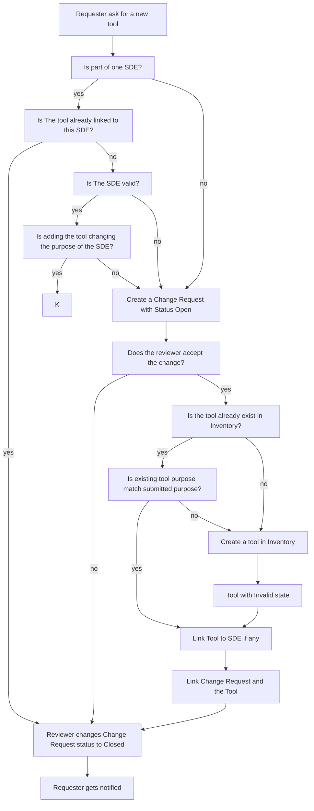

# Requester

Change Reqest:
- Tool, Version, Purpose

1. Requester ask for a new tool without SDE
2. Create a Change Request with Status "Open"
3. Reviewed by Supervisor
3.1. Supervisor rejects the change request
3.2. Change Request with Status "Closed"
4. Reviewer approves the change request
4.1 Reviewer creates Tool in Inventory and links the change request to the tool ID
4.2 The Tool has state invalid
4.3 Change Request with Status "Closed"
4.4 Requester gets notified about the change

--- Equipment -> he order licenses and agreed that the tool is used in the company.

Requester ask for a new tool not in the Software inventory with SDE Invalid

1. Requester ask for a new tool with SDE Number
2. Create a Change Request with Status "Open"
3. Reviewer checks
   1. Check if SDE is invalid
   2. Check if Tool is already linked
   3. Check Purpose of the SDE if adding the tool does not change anything
4. No -> Create a new Tool in the Software Inventory
5. link the Tool to the SDE
6. SDE is still invalid
7. links the change request to the tool, SDE
8. The Tool has state invalid
9. Change Request with Status "Closed"

Requester ask to use an existing tool in the Software inventory for an invalid SDE

1. Requester ask to use this tool in the SDE X
2. Create a Change Request with Status "Open"
3. Reviewer checks
   1. Check if SDE X is invalid
   2. Check if Tool is already linked to SDE X
   3. Check where Tool is used -> result: linked to SDE Y
   4. Check if requested purpose matches the current Tool Purpose
   5. Yes -> link the Tool to the SDE X
   6. No -> Create a new Tool in the Software Inventory with purpose,...

Requester ask to replace a tool with a non existing tool in the Software inventory to add to a valid SDE
1. Requester ask to use tool B in the SDE X, with reason why? Question are there new features a  dded to the SDE?
2. Create a Change Request with Status "Open"
3. Reviewer checks
   1. Set the SDE X to invalid
   2. Remove the Tool A from the SDE X
   3. Add the Tool B to the SDE X

Requester ask for a update BuildAgent not in the Software inventory which is used by multiple SDEs