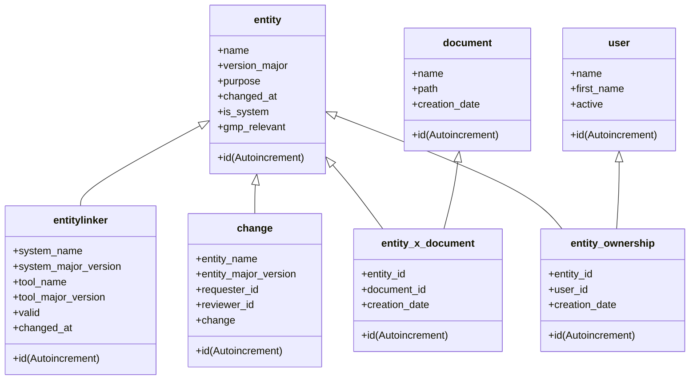

# Database Structure

The following shows the database structure of the backend. 

## Explanation

The following section explains the most important points of the database structure.

### entity

The entity table contains all entities. An entity can be a tool or a system. An entity is identified over his purpose, name and version_major. There cannot be a double entry with the same purpose, name, version_major.

### entitylinker

The entitylinker table links a tool to a system or a tool to another tool. This is used to show which system is affected by a tool and which tool is used by a system.

### entitiy_ownership
The entitiy ownership table contains all users that are responsible for an entity (defined ownership). A tool can have multiple owners. 
